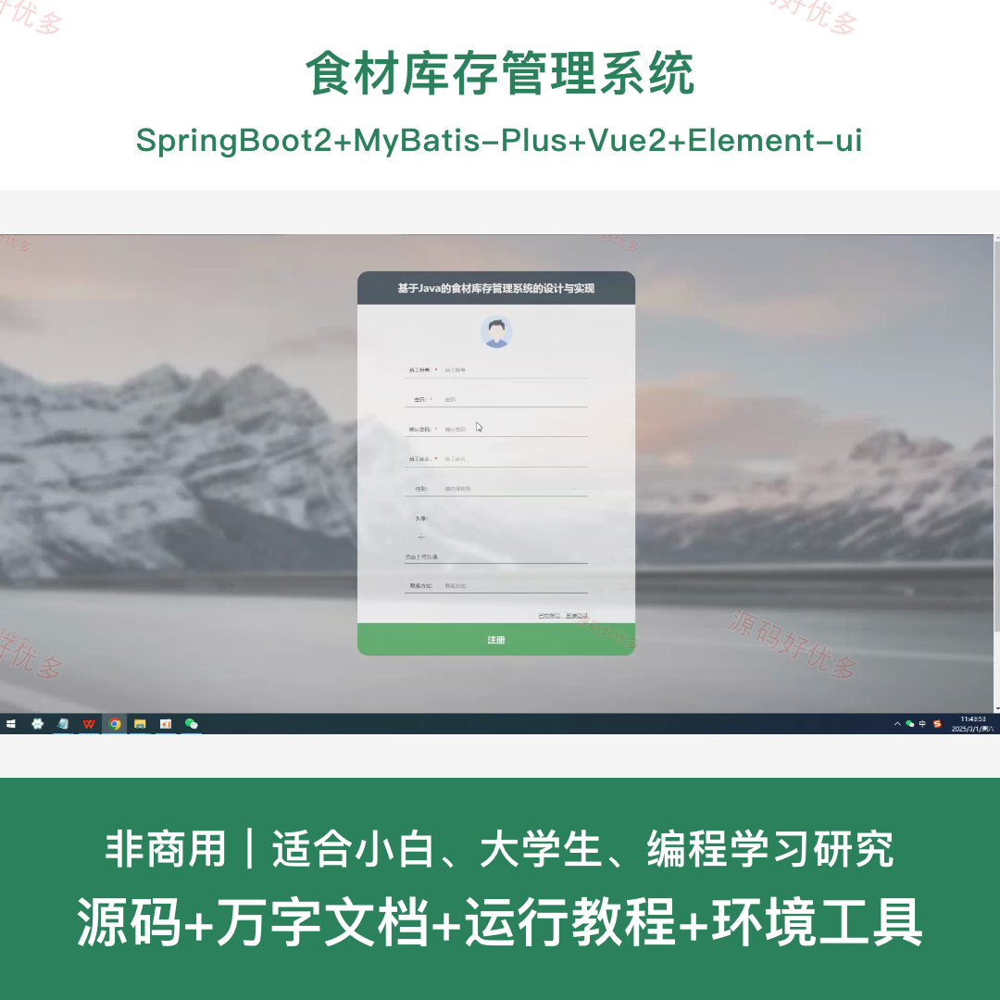
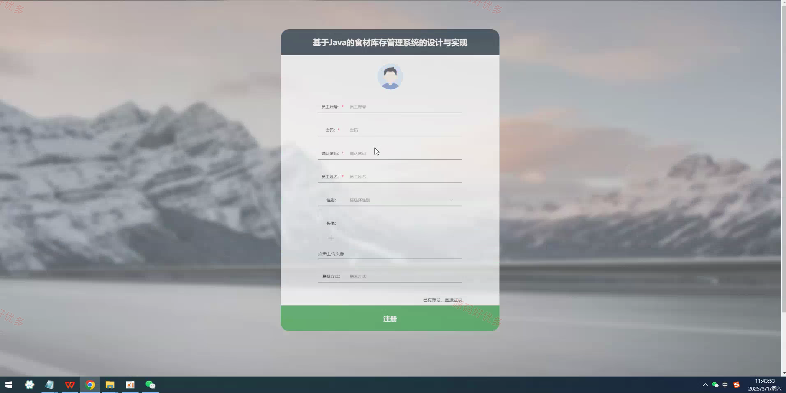
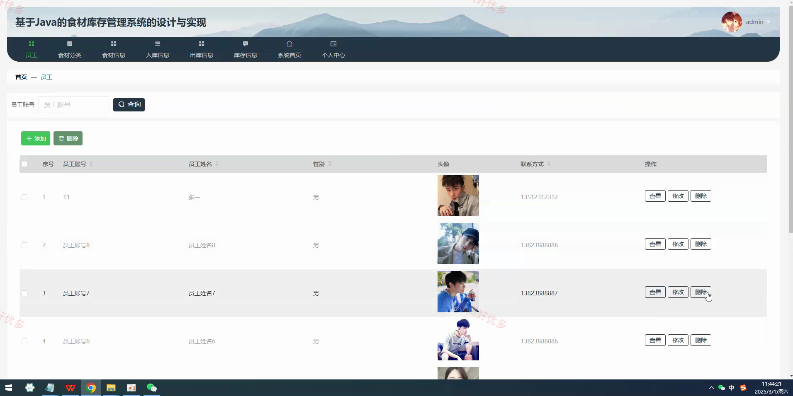
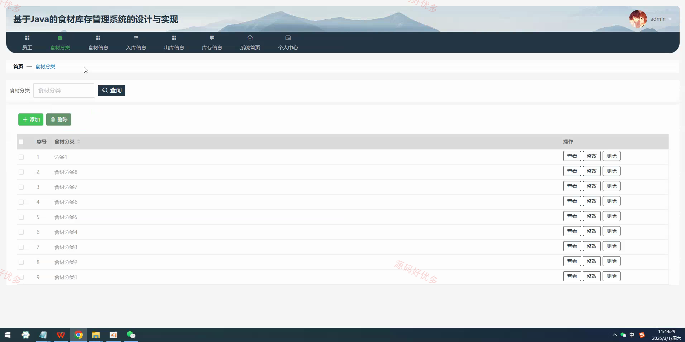
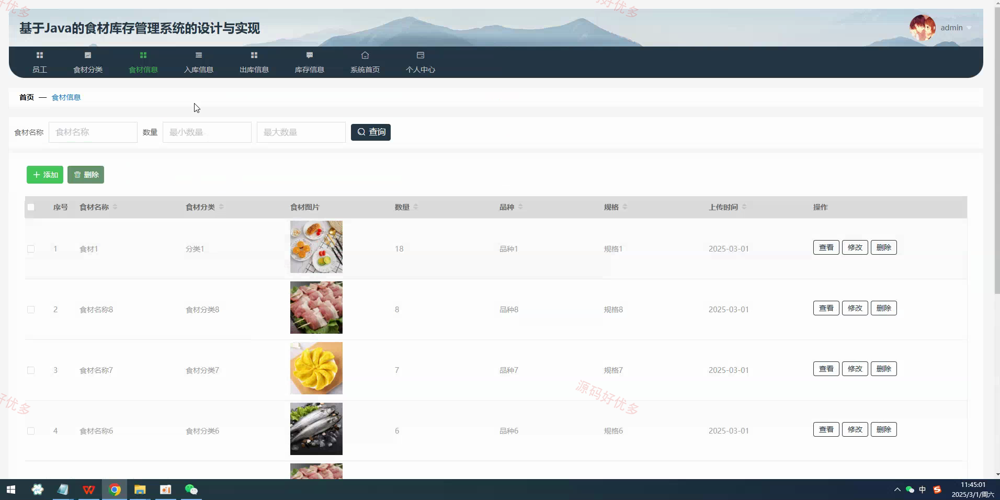
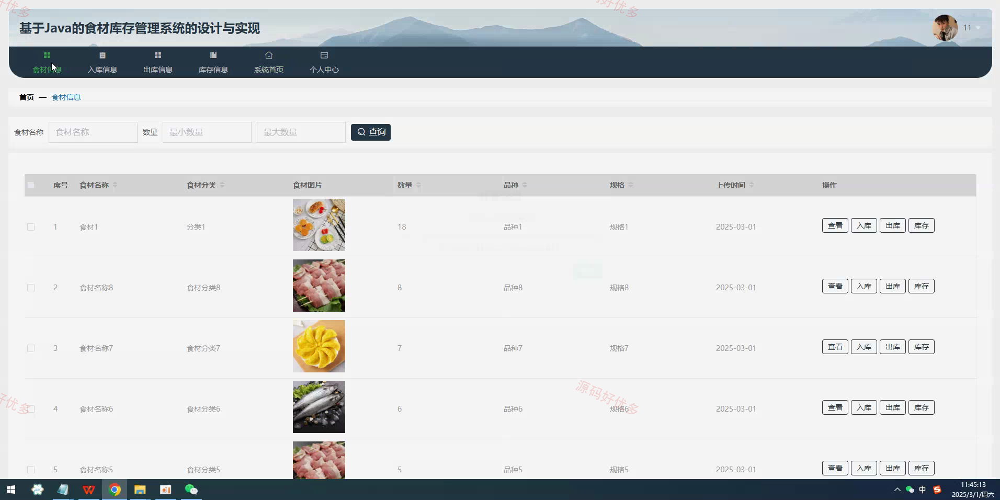
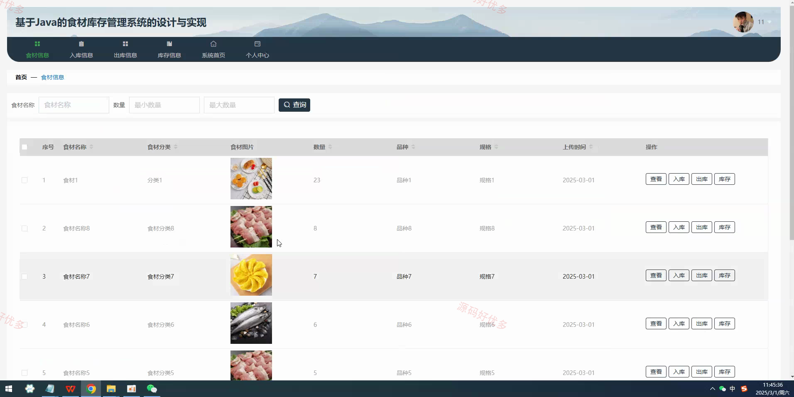
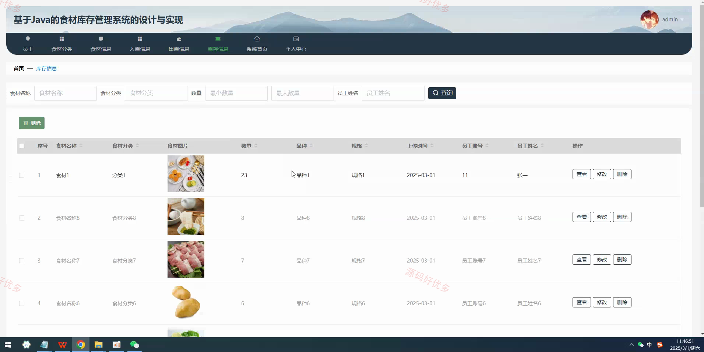
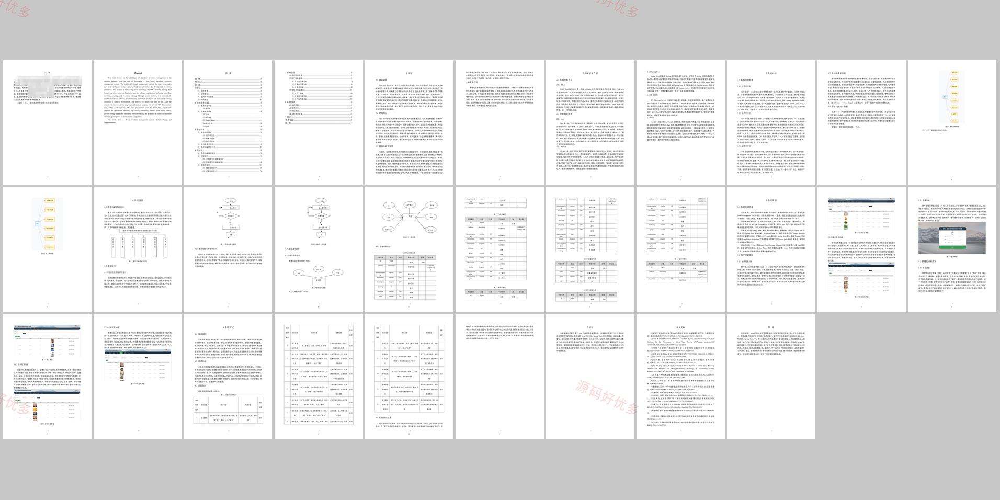

## 源码问题查看主页咨询

### 一、关键词
食材库存管理系统、食材信息、入库出库、库存统计、后台管理

### 二、作品包含
源码+数据库+万字设计文档+全套环境和工具资源+本地部署教程

### 三、项目技术
前端技术： Html、Css、Js、Vue2.6、Element-ui
后端技术：Java、SpringBoot2.2.2、MyBatis-Plus

### 四、运行环境（以下版本亲测，其他版本兼容性请自行测试）
开发工具：IDEA/eclipse + VSCODE

数据库：MySQL5.7+（共9张表）

数据库管理工具：Navicat10以上版本

环境配置软件： JDK1.8 + Maven3.6.3

前端Nodejs：14+

浏览器：谷歌浏览器

### 五、项目介绍
项目编号：springbootA557D

食材库存管理系统围绕食材基础信息、库存数量、入库登记、出库登记和员工管理展开，帮助管理员和员工完成食材库存维护、出入库记录查询以及后台业务管理演示。

角色：管理员、员工

用户功能：员工登录、食材信息维护、入库登记、出库登记、库存查询、个人信息维护。

管理员功能：员工管理、食材分类管理、食材信息管理、入库信息管理、出库信息管理、库存信息管理、轮播图配置。

### 六、运行截图

